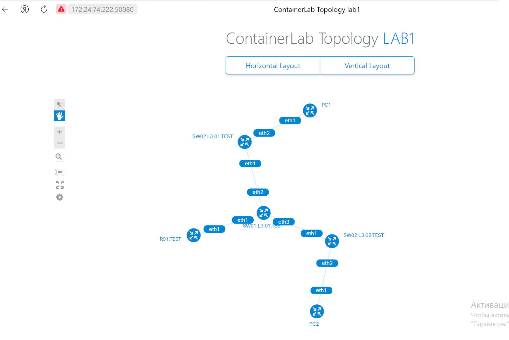
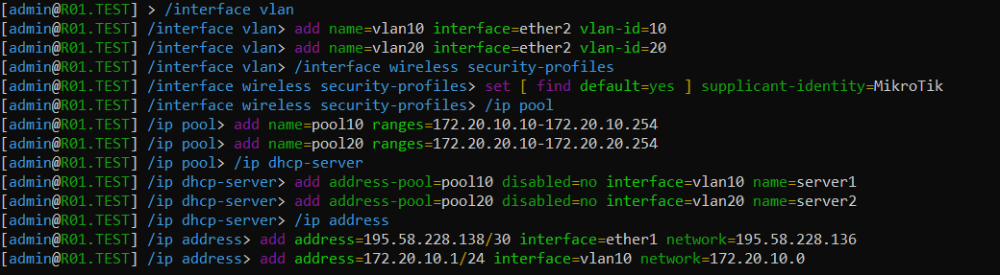
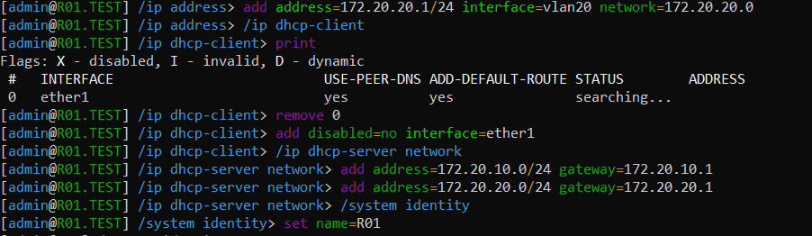
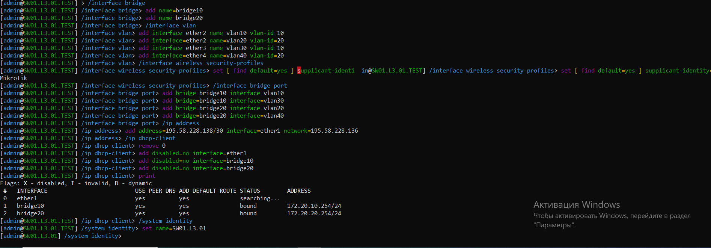
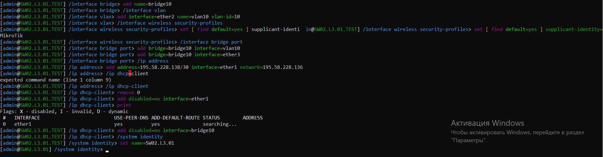
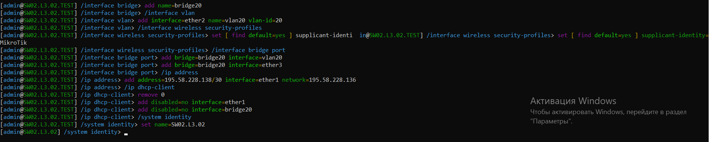
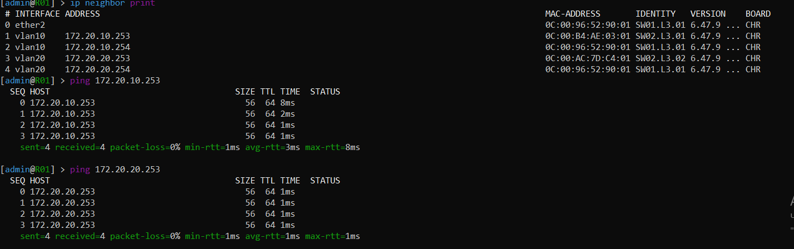

University: [ITMO University](https://itmo.ru/ru/)

Faculty: [FICT](https://fict.itmo.ru)

Course: [Introduction in routing](https://github.com/itmo-ict-faculty/introduction-in-routing)

Year: 2023/2024

Group: K33212

Author: Petrov Dmitry Konstantinovich

Lab: Lab1

Date of create: 15.10.2023

Date of finished: 

# Лабораторная работа № 1

## Описание

В данной лабораторной работе вы познакомитесь с инструментом ContainerLab, развернете тестовую сеть связи, настроите оборудование на базе Linux и RouterOS.

## Цель работы

Ознакомиться с инструментом ContainerLab и методами работы с ним, изучить работу VLAN, IP адресации и т.д.

## Ход работы

В начале работы были выполнены подготовительные шаги по установке необходимого софта, указанного в описании лабораторной работы

Далее была создана топология сети:
```
name: lab1

mgmt:
  network: statics
  ipv4_subnet: 192.168.50.0/24

topology:
  nodes:
   PC1:
    kind: linux
    image: ubuntu:latest
    mgmt-ipv4: 192.168.50.3

   PC2:
    kind: linux
    image: ubuntu:latest
    mgmt-ipv4: 192.168.50.4
    
   R01.TEST:
    kind: vr-ros
    image: vrnetlab/vr-routeros:6.47.9
    mgmt-ipv4: 192.168.50.2

   SW01.L3.01.TEST:
    kind: vr-ros
    image: vrnetlab/vr-routeros:6.47.9
    mgmt-ipv4: 192.168.50.5

   SW02.L3.01.TEST:
    kind: vr-ros
    image: vrnetlab/vr-routeros:6.47.9
    mgmt-ipv4: 192.168.50.6

   SW02.L3.02.TEST:
    kind: vr-ros
    image: vrnetlab/vr-routeros:6.47.9
    mgmt-ipv4: 192.168.50.7

  links:
    - endpoints: ["R01.TEST:eth1", "SW01.L3.01.TEST:eth1"]
    - endpoints: ["SW01.L3.01.TEST:eth2", "SW02.L3.01.TEST:eth1"]
    - endpoints: ["SW02.L3.01.TEST:eth2", "PC1:eth1"]
    - endpoints: ["SW01.L3.01.TEST:eth3", "SW02.L3.02.TEST:eth1"]
    - endpoints: ["SW02.L3.02.TEST:eth2", "PC2:eth1"]
```

## Граф



## Настройка

Далее была произведена настройка роутера:




* созданы вланы
* созданы пулы адресов для вланов
* созданы dhcp сервера с созданными пулами для выдачи адресов в каждом из вланов
* выдаются ip адреса для интерфейсов вланов

После идет настройка свича верхнего уровня



* создание мостов и их связывание с вланами
* включение dhcp клиента для получения конфигураций

Далее настраиваются два свича нижнего уровня




* создается мост и связывается с вланом

## Тестирование

