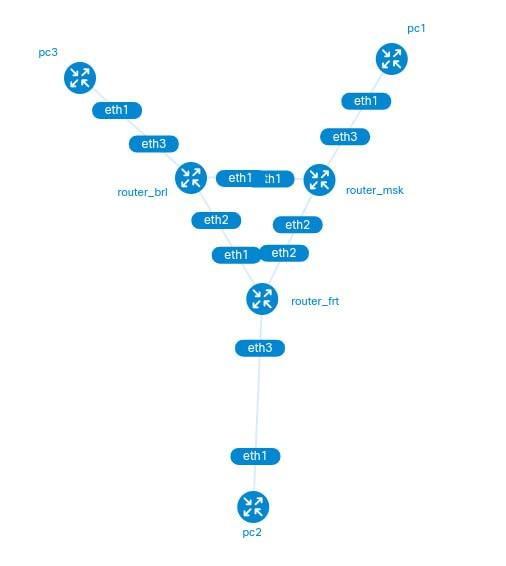
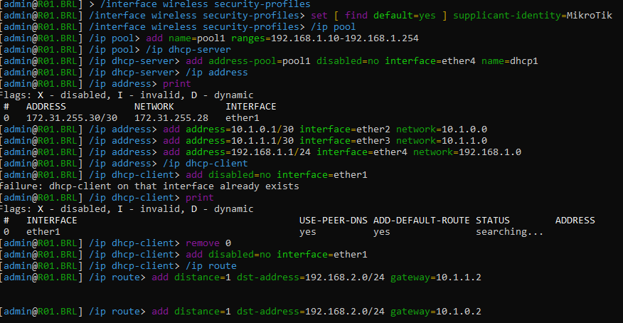
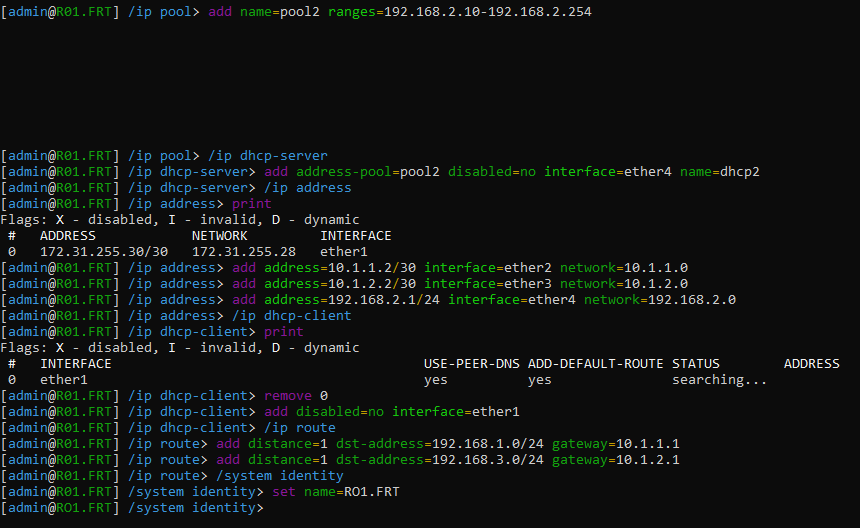
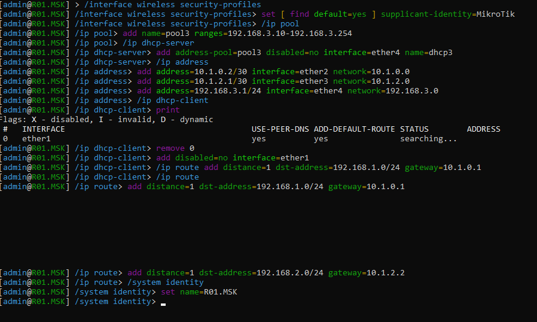
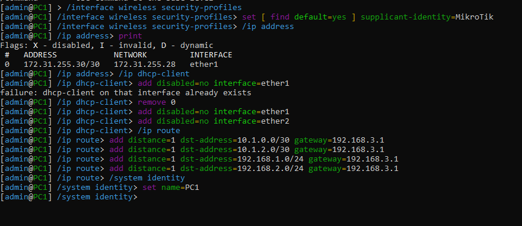
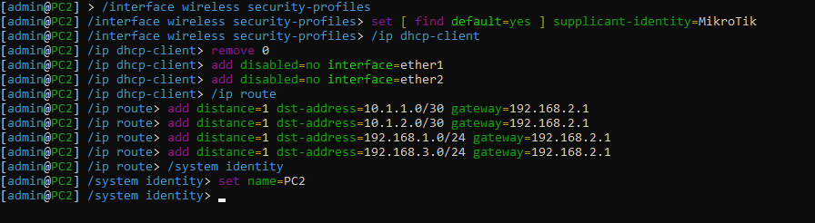
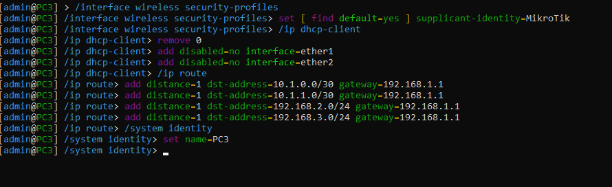
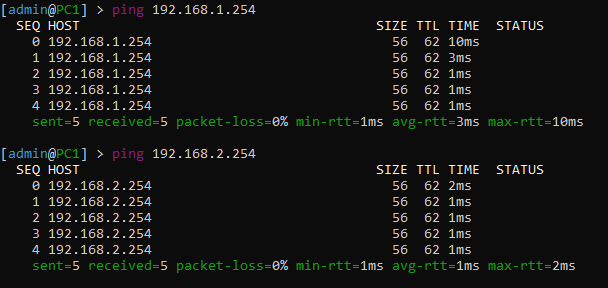
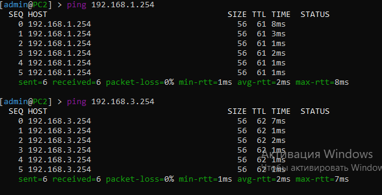
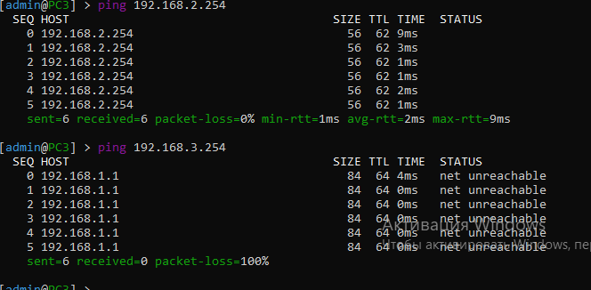

University: [ITMO University](https://itmo.ru/ru/)

Faculty: [FICT](https://fict.itmo.ru)

Course: [Introduction in routing](https://github.com/itmo-ict-faculty/introduction-in-routing)

Year: 2023/2024

Group: K33212

Author: Petrov Dmitry Konstantinovich

Lab: Lab2

Date of create: 13.11.2023

Date of finished: 

# Лабораторная работа № 1

## Описание

В данной лабораторной работе вы первый раз познакомитесь с компанией "RogaIKopita Games" LLC которая занимается разработкой мобильных игр с офисами в Москве, Франкфурте и Берлине. Для обеспечения работы своих офисов "RogaIKopita Games" вам как сетевому инженеру необходимо установить 3 роутера, назначить на них IP адресацию и поднять статическую маршрутизацию. В результате работы сотрудник из Москвы должен иметь возможность обмениваться данными с сотрудником из Франкфурта или Берлина и наоборот.

## Цель работы

Ознакомиться с принципами планирования IP адресов, настройке статической маршрутизации и сетевыми функциями устройств.

## Ход работы

1. Составлена топология сети:
```
name: lab2

mgmt:
  network: statics2
  ipv4_subnet: 192.1.1.0/24

topology:
  nodes:
   R01.BRL:
    kind: vr-ros
    image: vrnetlab/vr-routeros:6.47.9
    mgmt-ipv4: 192.1.1.2

   R01.FRT:
    kind: vr-ros
    image: vrnetlab/vr-routeros:6.47.9
    mgmt_ipv4: 192.1.1.3

   R01.MSK:
    kind: vr-ros
    image: vrnetlab/vr-routeros:6.47.9
    mgmt_ipv4: 192.1.1.4

   PC1:
    kind: vr-ros
    image: vrnetlab/vr-routeros:6.47.9
    mgmt-ipv4: 192.1.1.5

   PC2:
    kind: vr-ros
    image: vrnetlab/vr-routeros:6.47.9
    mgmt-ipv4: 192.1.1.6

   PC3:
    kind: vr-ros
    image: vrnetlab/vr-routeros:6.47.9
    mgmt-ipv4: 192.1.1.7

  links:
    - endpoints: ["R01.BRL:eth1", "R01.MSK:eth1"]
    - endpoints: ["R01.BRL:eth2", "R01.FRT:eth1"]
    - endpoints: ["R01.MSK:eth2", "R01.FRT:eth2"]
    - endpoints: ["R01.BRL:eth3", "PC3:eth1"]
    - endpoints: ["R01.FRT:eth3", "PC2:eth1"]
    - endpoints: ["R01.MSK:eth3", "PC1:eth1"]
```

схема:



2. Далее произведена настройка всех устройств сети:

    Конфигурация R01.BRL:
   
    
    
    Конфигурация R01.FRT:

   

   Конфигурация R01.MSK:

   

   Конфигурация PC1:

   

   Конфигурация PC2:

   

   Конфигурация PC3:

   
3. Далее было произведено тестирование сети с помощью утилиты ping

   Ping с PC1:

   

   Ping с PC2:

   

   Ping с PC3:

   