University: [ITMO University](https://itmo.ru/ru/)
Faculty: [FICT](https://fict.itmo.ru)

Course: [Introduction in routing](https://github.com/itmo-ict-faculty/introduction-in-routing)

Year: 2023/2024

Group: K33212

Author: Petrov Dmitry Konstantinovich

Lab: Lab3

Date of create: 17.12.2023

Date of finished:

# Лабораторная работа № 3

## Цель работы

Изучить протоколы OSPF и MPLS, механизмы организации EoMPLS.

## Ход работы

1. Составлена топология сети:
```
name: lab3

mgmt:
  network: lab3
  ipv4_subnet: 172.20.20.0/24

topology:
  nodes:
    R01.NY:
      kind: vr-ros
      image: vrnetlab/vr-routeros:6.47.9
      mgmt_ipv4: 172.20.20.11

    R01.LND:
      kind: vr-ros
      image: vrnetlab/vr-routeros:6.47.9
      mgmt_ipv4: 172.20.20.12

    R01.LBN:
      kind: vr-ros
      image: vrnetlab/vr-routeros:6.47.9
      mgmt_ipv4: 172.20.20.13

    R01.HKI:
      kind: vr-ros
      image: vrnetlab/vr-routeros:6.47.9
      mgmt_ipv4: 172.20.20.14

    R01.MSK:
      kind: vr-ros
      image: vrnetlab/vr-routeros:6.47.9
      mgmt_ipv4: 172.20.20.15

    R01.SPB:
      kind: vr-ros
      image: vrnetlab/vr-routeros:6.47.9
      mgmt_ipv4: 172.20.20.16

    SGI-Prism:
      kind: vr-ros
      image: vrnetlab/vr-routeros:6.47.9
      mgmt_ipv4: 172.20.20.21

    PC1:
      kind: vr-ros
      image: vrnetlab/vr-routeros:6.47.9
      mgmt_ipv4: 172.20.20.31

  links:
    - endpoints: ["R01.NY:eth1", "SGI-Prism:eth1"]
    - endpoints: ["R01.NY:eth2", "R01.LND:eth1"]
    - endpoints: ["R01.NY:eth3", "R01.LBN:eth1"]
    - endpoints: ["R01.LND:eth2", "R01.HKI:eth1"]
    - endpoints: ["R01.LBN:eth2", "R01.MSK:eth1"]
    - endpoints: ["R01.LBN:eth3", "R01.HKI:eth3"]
    - endpoints: ["R01.HKI:eth2", "R01.SPB:eth2"]
    - endpoints: ["R01.MSK:eth2", "R01.SPB:eth1"]
    - endpoints: ["R01.SPB:eth3", "PC1:eth1"]
```

Схема:

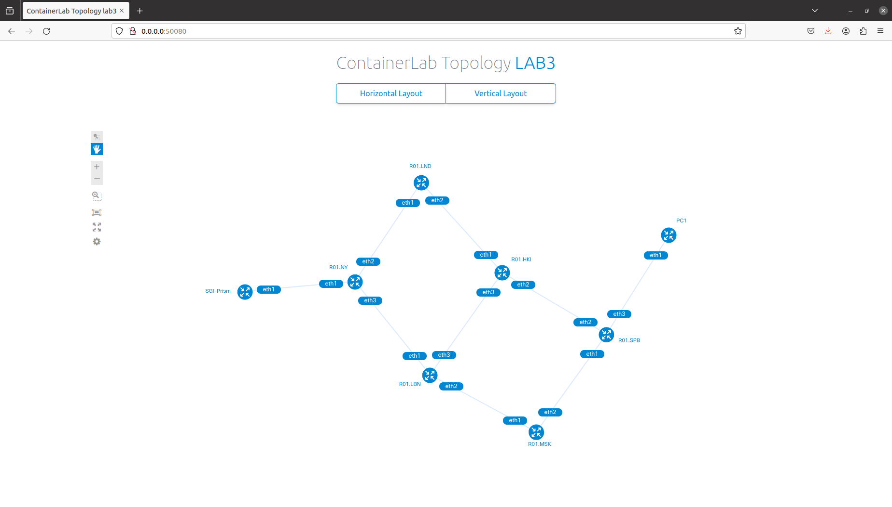

2. Далее произведена настройка всех устройств
* R01.NY
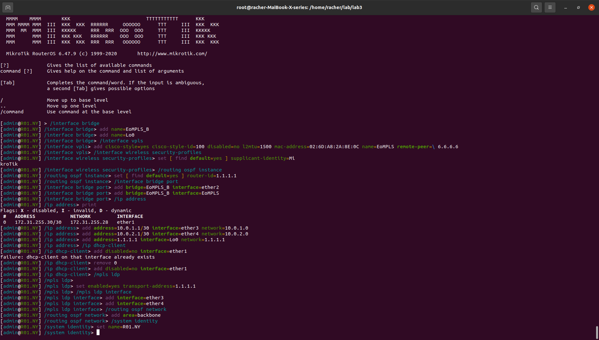
* R01.LND
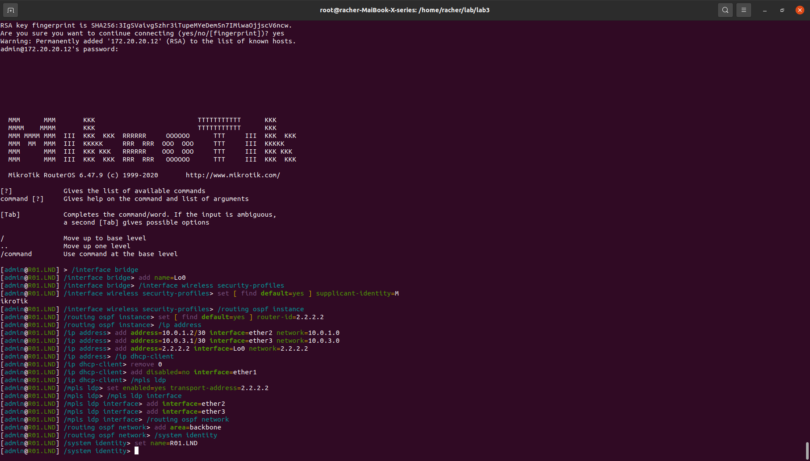
* R01.LBN
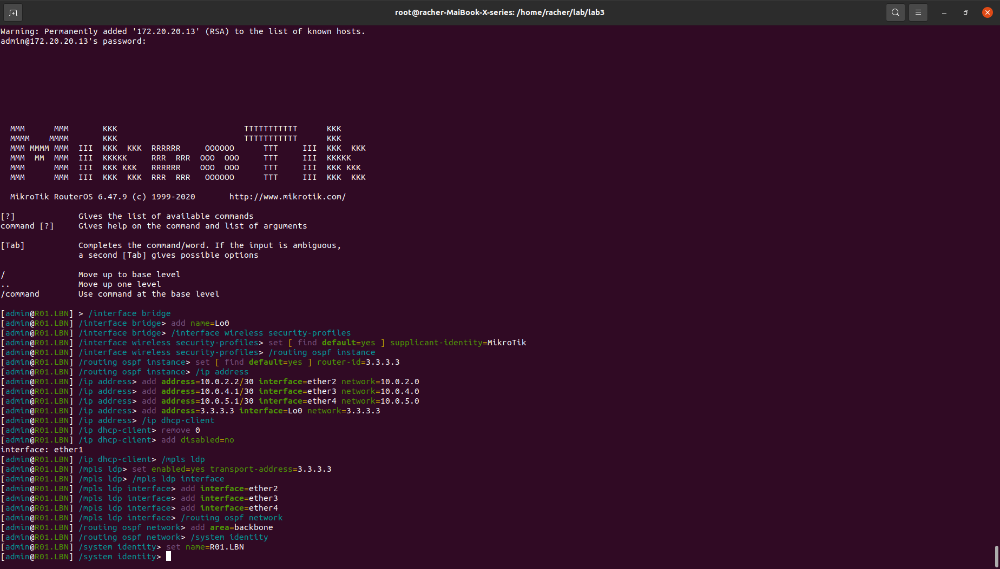
* R01.HKI
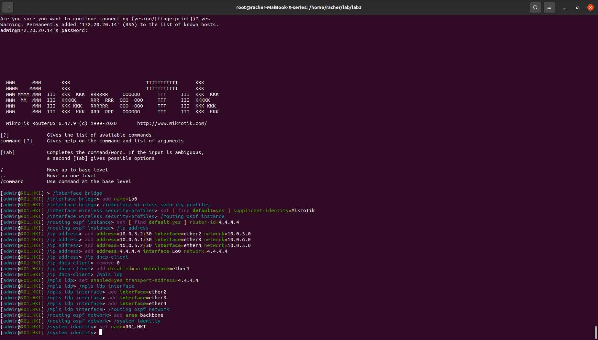
* R01.MSK
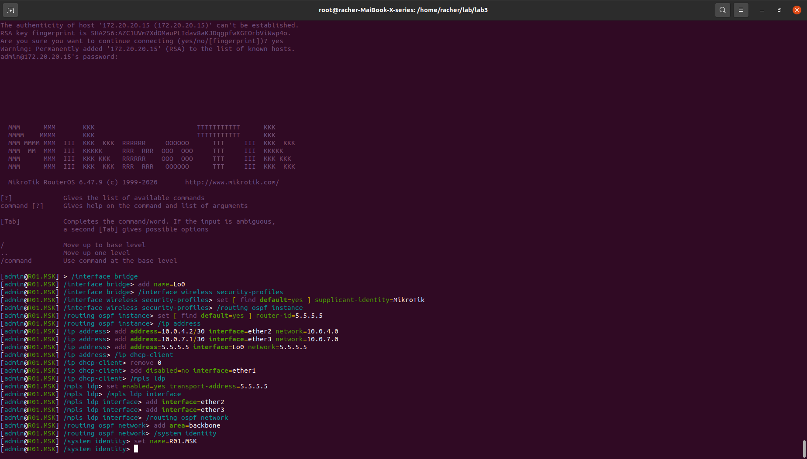
* R01.SPB
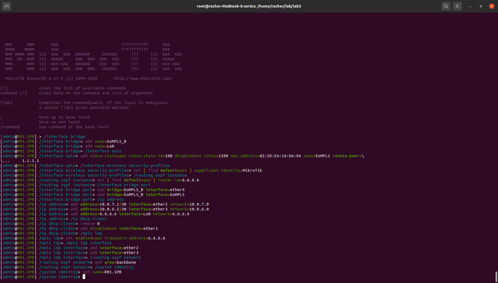
* SGI Prism
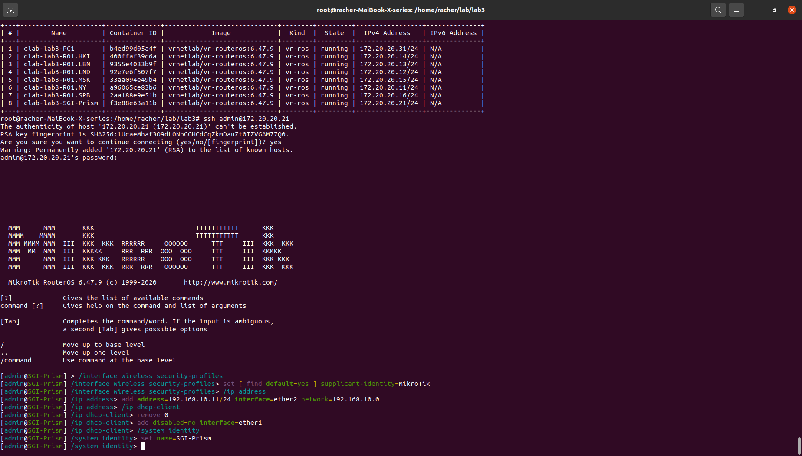
* PC1
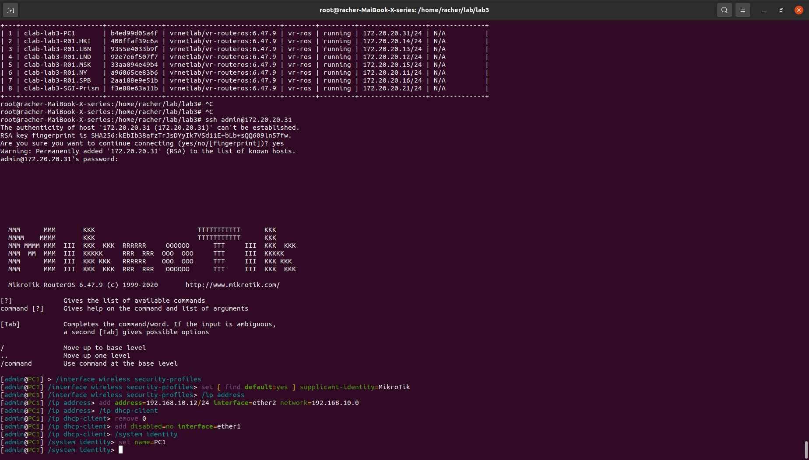

4. Тесты:
* Таблицы MPLS
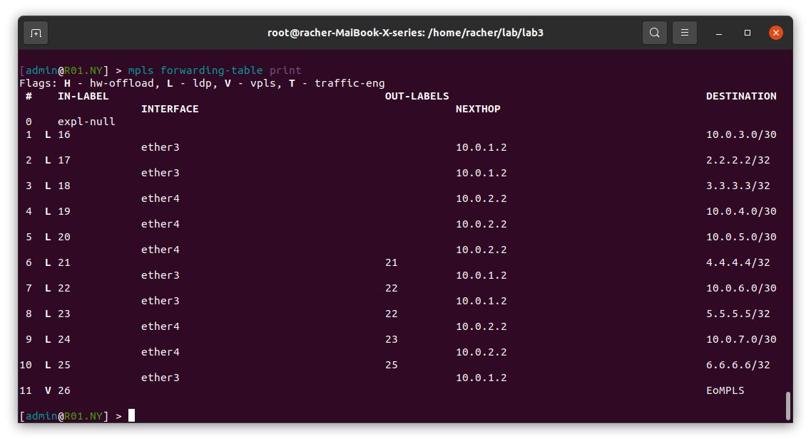
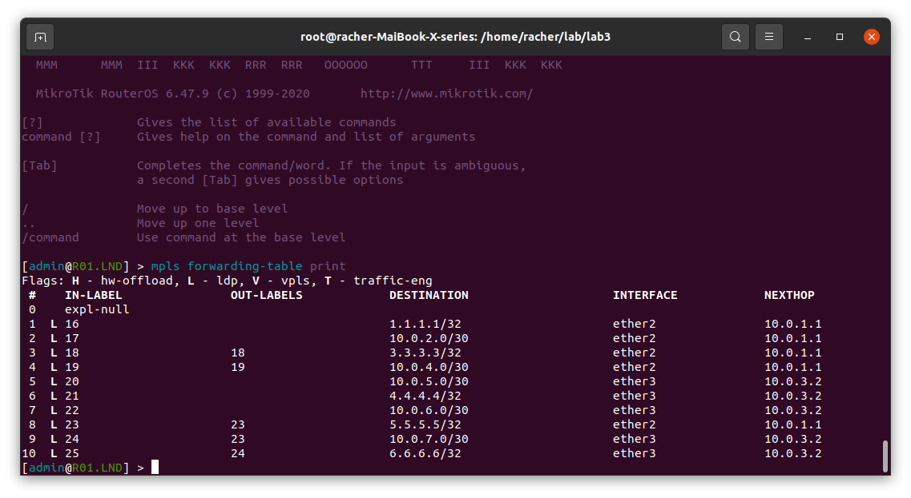

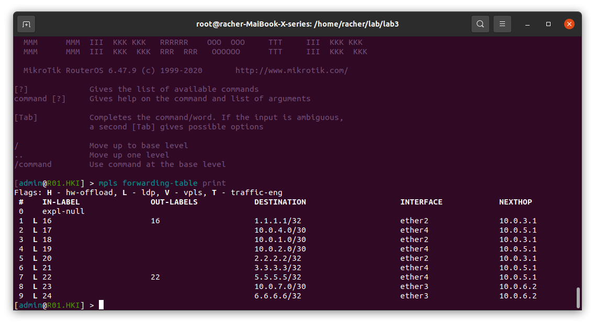
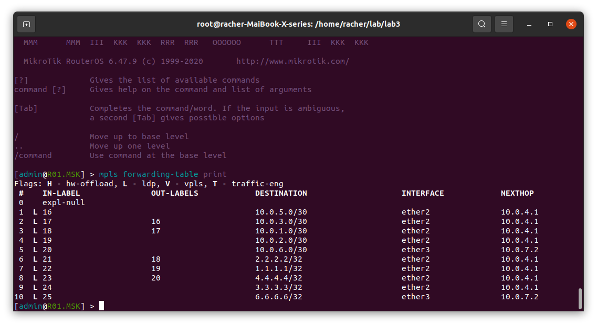
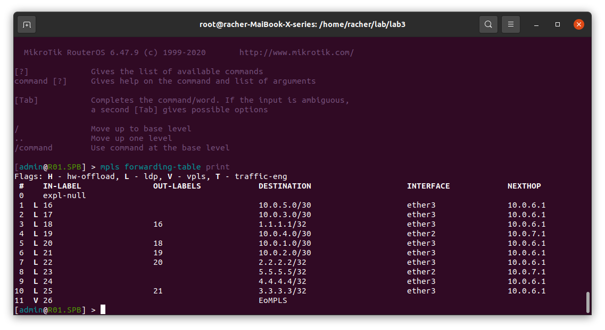
* Пинг пк и сервера
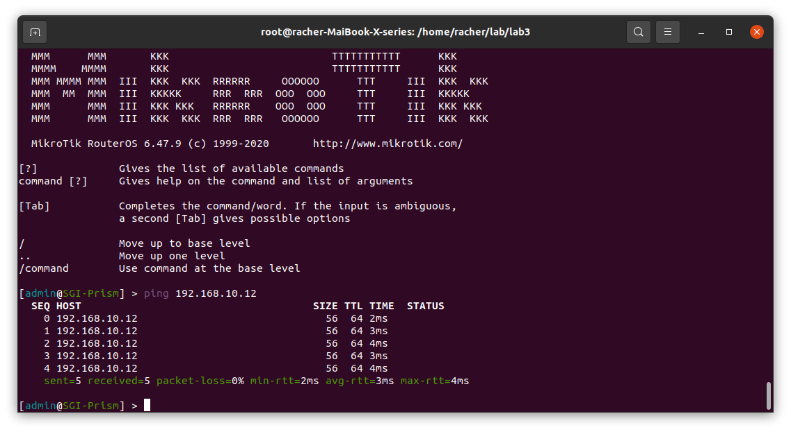
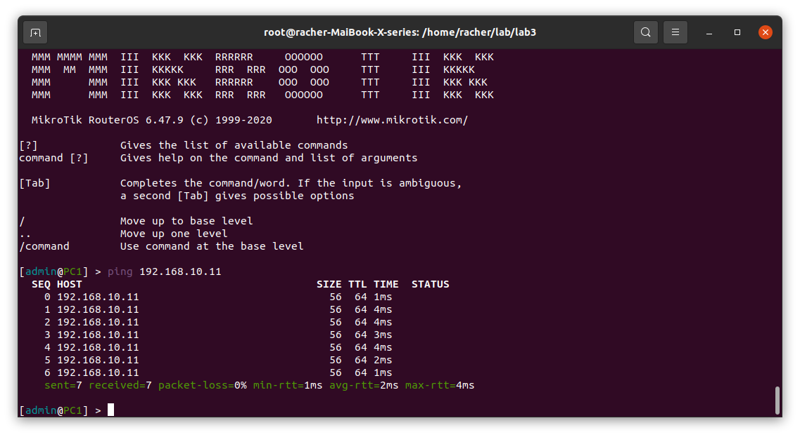

5. Вывод:
   Выполнив данную работу я изучил протоколы OSPF и MPLS, механизмы организации EoMPLS и создал сеть для компании RogaIKopita Games.